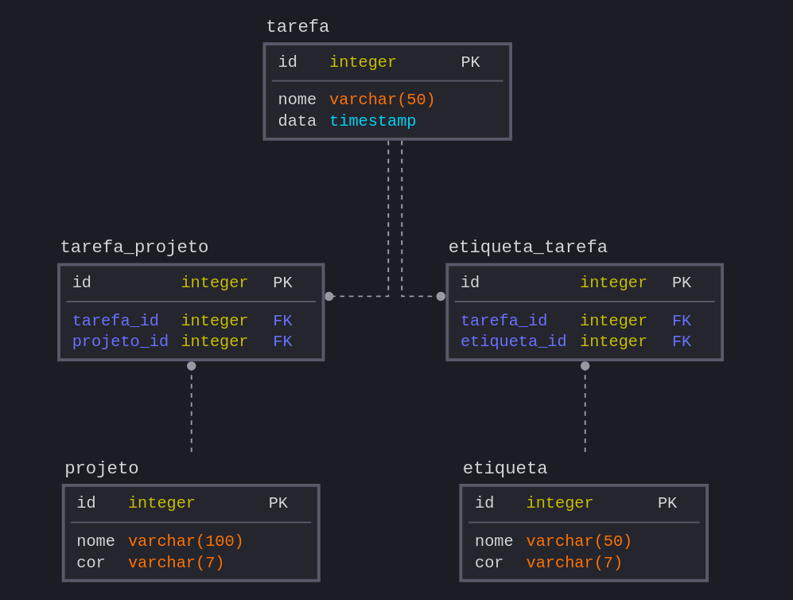

# 📝 Projeto Final LP2

Front-end em ReactJS e Next.js e backend em dotnet

[link para testar frontend](https://projeto-lp2.vercel.app/)

# Como iniciar

### Pré-requisito
  - [docker](https://docs.docker.com/docker-for-windows/install/)

```bash
docker-compose up --build
```

BACKEND - http://localhost:5000/

FRONTEND - http://localhost:3000/


# Banco de dados 

